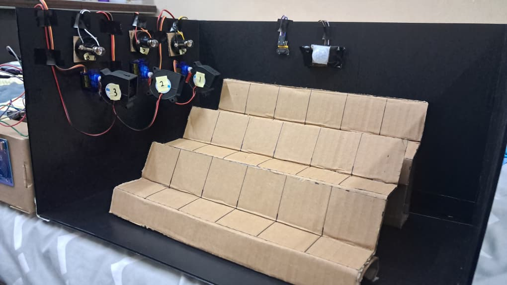
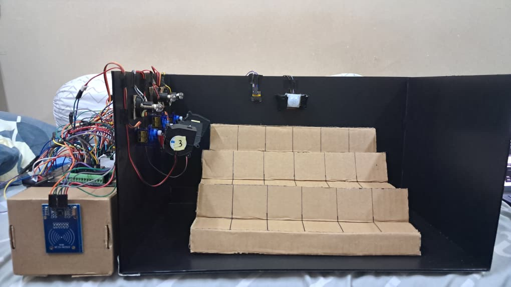
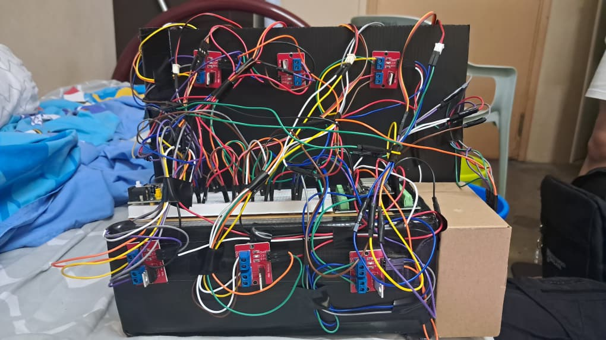

# Sensor X Sensei
**UM Technothon 2026 | Smart Micro-Climate Energy Management System**

## 🚀 Executive Summary
Sensor X Sensei is an intelligent, automated energy management solution for modern lecture halls. By leveraging IoT-based occupancy tracking, the system dynamically routes power—specifically HVAC ventilation and localized lighting—only to occupied rows. This prototype demonstrates a measurable reduction in energy wastage, transforming traditional static classrooms into responsive, energy-efficient environments.

## 💡 The Problem
In large university lecture halls, lighting and ventilation are typically maintained at 100% capacity regardless of occupancy. This results in significant electricity wastage, excessive carbon footprints, and unnecessary operating costs for educational institutions.

## 🧠 Our Solution
Sensor X Sensei employs a distributed sensor network and "Energy Passport" authentication to:

* **Authenticate Presence:** NFC-based check-ins ensure only verified occupancy triggers power routing.
* **Dynamic Zoning:** Using a PIR and Time-of-Flight (TOF) sensor array, the system maps room occupancy and activates only the relevant climate zone.
* **Live Intelligence:** A real-time digital twin dashboard provides administrators with actionable analytics, energy savings metrics, and predictive usage trends.

## 🛠️ Hardware Stack
* **Brain:** ESP32 DOIT DEVKIT V1
* **Sensors:** 
  * MFRC522 (NFC Reader)
  * HC-SR501 (PIR Motion Detection)
  * VL53L0X (TOF Laser Depth Ranging)
* **Actuators:**
  * IRF520 MOSFET Modules (Power routing for Fans & E10 Lighting)
  * SG90 Servo Motors (Mechanical air-flow direction control)
* **Architecture:** Dual-rail power system (5V Logic / 15V Load Rail)

## 💻 Software & Dashboard
* **Firmware:** C++ (Arduino Core) featuring a high-concurrency WebServer for real-time telemetry.
* **UI/UX:** A bespoke "Glassmorphism" web dashboard featuring a Digital Twin visualization of the classroom, real-time analytics, and an AI-driven energy saving recommendation engine.
* **100% Authentic Telemetry:** The firmware communicates directly over I2C and physical hardware interrupts to provide a completely authentic, unsimulated IoT architecture.

## 📊 Sustainability Metrics
The dashboard provides real-time reporting on:

* **Energy Efficiency:** Calculated reduction in wattage per session.
* **Environmental Impact:** Real-time CO₂ reduction based on the Malaysian national power grid emission factor (0.785 kg CO₂/kWh).
* **Occupancy Trends:** Predictive modeling for peak class capacity.

## 🖼️ Hardware Configuration
The system is divided into three distinct micro-climate zones (Zone A, B, and C), each independently controlled by the ESP32 via IRF520 power MOSFETs. The setup is configured for modularity, allowing for easy scaling of the "Digital Twin" to any lecture hall size.

## 📸 Physical Prototype Showcase
The physical model is a highly detailed, functional representation of a tiered lecture hall, completely wired for real-time tracking:

*Front View: A 3-tier classroom model constructed from Impra board. The wall features the I2C TOF laser array and PIR motion sensor facing the seats. Each zone is equipped with a functional E10 lightbulb, a 12V ventilation fan, and an SG90 servo motor for directional sweeping.*

*NFC Podium: A dedicated podium housing the MFRC522 Energy Passport scanner, where students tap in to initiate the session and power up Zone 1.*

*Backend Architecture: The master control center featuring the ESP32 brain, robust wire management, and an array of 6 IRF520 MOSFETs safely separating the 5V logic rail from the high-power fan and lighting rail.*
